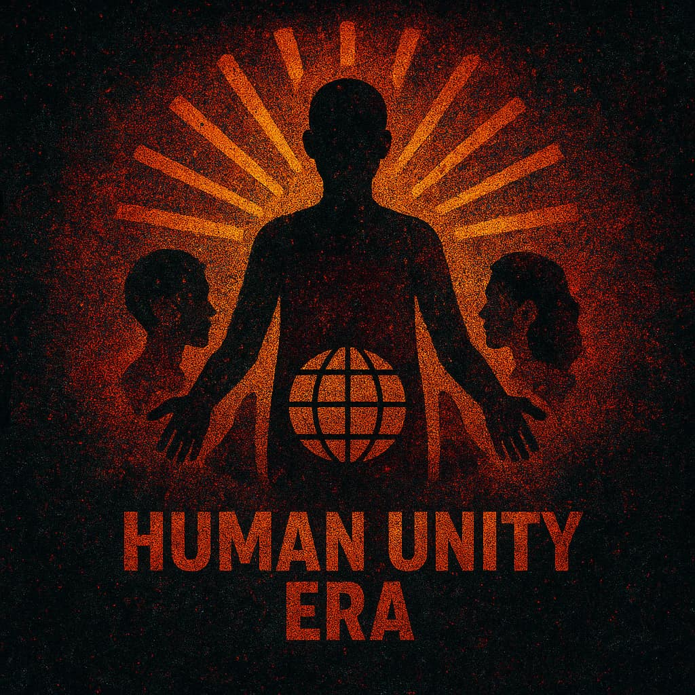

<!DOCTYPE html>
<html lang="en">
<head>
<meta charset="utf-8" />
<meta name="viewport" content="width=device-width,initial-scale=1" />
<title>HUE — Broadcast Hero Test</title>

</head>
<body>

<section class="hero" aria-label="Emergency broadcast">
  <!-- Retro static -->
  <canvas id="noise"></canvas>
  

  <!-- Ghost emblem behind text (very faint) -->
  

    
  

  <!-- TIMES UP -->
  

    
<h1>TIME’S UP</h1>

  

  <!-- Message slide 1 -->
  

    

We are the people. We are the majority. We are the ones that matter.

  

  <!-- Message slide 2 (7s hold) -->
  

    

The time of allowing ego-driven “world leaders” to lead us into war for profit is over. We, the people of the world, will have the final say.

  

  <!-- Emblem breakthrough pulses -->
  

    
  

  <!-- Dead static window (7s) -->
  

  

    
  

</section>

</body>
</html>
